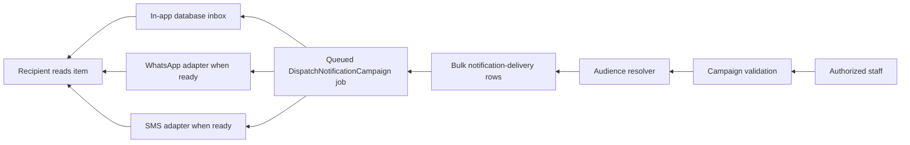

# Academic Groups and Queued Notifications

## Purpose and release boundary

This feature provides an **authorization-safe communication workflow** for the Al‑Imtiaz Math Platform. Authorized staff can maintain academic groups, assign or remove students in bulk, and queue a notification for all parents, all students, selected recipients, a grade, or one academic group. The first active delivery channel is the application’s database-backed inbox.

The implementation deliberately separates **dynamic staff settings** from secrets. Teachers with the relevant permission can choose enabled channels, sender labels, approved template names, and target audiences. They cannot view or edit provider access tokens, webhook secrets, phone-number IDs, or SMS authentication values. Those values remain environment-managed and administrator-owned.

## Access model

| Capability                                              | Permission                      | Principal boundary                             |
| ------------------------------------------------------- | ------------------------------- | ---------------------------------------------- |
| Create, update, delete, and bulk-manage academic groups | `groups.manage`                 | Administrator or explicitly authorized teacher |
| Queue a notification campaign                           | `notifications.send`            | Administrator or explicitly authorized teacher |
| Change non-secret channel options                       | `notifications.channels.manage` | Administrator or explicitly authorized teacher |
| Read an inbox and mark personal items read              | Authenticated parent or student | Only the recipient’s own notifications         |
| Configure provider secrets                              | Environment / project owner     | Never available through staff API or UI        |

The authenticated-user response exposes capability flags, and the Arabic dashboard hides capability-specific controls when the corresponding server permission is absent. The server remains authoritative: all write routes apply Sanctum guard matching and Laravel permission middleware.

## Academic groups

An academic group belongs to a grade and has a unique name within that grade. Its `academic_group_student` membership table supports a multi-select staff workflow:

1. An authorized staff member creates or opens a group.
2. The UI shows students for the selected grade only.
3. The staff member selects the desired membership set and saves once.
4. The repository synchronizes the membership set and returns an eager-loaded resource with the current student count.

The group list uses `withCount('students')`; group details explicitly load the limited student fields used by the API resource. This prevents a per-row relationship query in the staff interface.

## Campaign and delivery lifecycle



Campaign creation is transactional. Recipient IDs are resolved once, then delivery rows are inserted in bulk. The queued dispatcher chunk-loads recipients, their student accounts and students, plus any existing channel records. The channel service loads settings once and bulk-creates missing per-channel delivery records before iterating. This removes N+1 read queries from group and notification dispatch paths while retaining necessary per-recipient delivery state updates.

| State       | Meaning                                                                      |
| ----------- | ---------------------------------------------------------------------------- |
| `pending`   | A campaign recipient is waiting for a queued dispatch attempt.               |
| `delivered` | At least one selected channel delivered successfully.                        |
| `failed`    | No selected channel could deliver; the failure record identifies the reason. |
| `skipped`   | A configured adapter was not ready, enabled, or eligible for that recipient. |

## Channels and external-provider boundary

| Channel              | Current readiness                           | Notes                                                                                                                                                                                            |
| -------------------- | ------------------------------------------- | ------------------------------------------------------------------------------------------------------------------------------------------------------------------------------------------------ |
| In-app               | Active by default                           | Uses Laravel database notifications; provides a parent/student inbox and read state.                                                                                                             |
| WhatsApp Cloud API   | Adapter-ready, disabled without credentials | Requires an approved business setup, a phone-number ID, access token, recipient number, and approved template outside the WhatsApp service window. Provider receipt IDs are stored per delivery. |
| SMS (Twilio adapter) | Adapter-ready, disabled without credentials | Requires account SID, auth token, and approved sender number. Provider receipt IDs are stored per delivery.                                                                                      |

Automatic WhatsApp-group provisioning is **not enabled by default**. It can only be considered after a verified Official Business Account is configured and Meta’s current Group API eligibility, invite-only behavior, participant cap, recipient consent, and webhook requirements are satisfied. The application does not guess an unsupported provider endpoint or create personal chat groups from staff data.

## Free Autoscale queue processing

Free Autoscale hosting does not guarantee an always-running queue process. Jobs therefore persist in the database and the application exposes a **signed** endpoint:

`POST /api/scheduled/notifications/drain?expires=…&signature=…`

After the project is published, configure a managed schedule to call a fresh, Laravel-signed URL at the chosen interval. Each request drains a bounded number of notification jobs from the `notifications` queue. This keeps the feature free of a persistent-worker charge while accepting scheduled, rather than immediate, processing latency.

> The endpoint must never be called without a valid Laravel signature. Do not convert it into a public route or place provider secrets in the schedule URL.

## Operations, tests, and migrations

The feature introduces academic-group and notification-channel migrations, Laravel factories/seed data, backend feature coverage for role-gated group membership and group audiences, typed client API coverage, Laravel static analysis, and frontend tests. Use the repository quality gate before release:

```bash
php artisan test --compact
composer analyse
pnpm lint
pnpm check
pnpm test:frontend
pnpm build
composer validate --strict
pnpm exec prettier --check README.md docs/groups-notifications.md docs/srs-ar.md
git diff --check
```

The test suite uses a clean database and verifies that only parent and student accounts linked to an academic-group member receive a group campaign. It also verifies that staff may change non-secret channel configuration but responses never contain external provider secrets.
